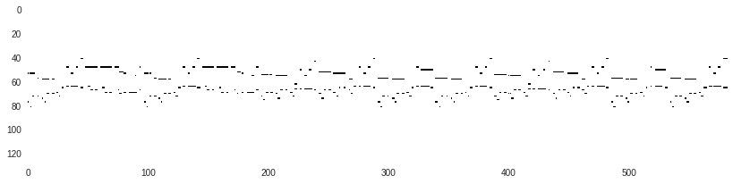
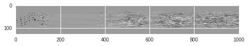

# ml_music
Compose music with machine learning.

## Training data
* music/liszt/liz_donjuan.mid
* music/liszt/liz_et1.mid
* ...

These are converted to "piano roll" array (time × 128 keys) as preprocessing.


## Architecture
```
tf.keras.Sequential([
    tf.keras.layers.Dense(...),
    tf.keras.layers.LSTM(...),
    tf.keras.layers.Dense(...),
])
```

## Genarated music example
Raw output:  


Discretizesed output (see piano_roll_to_pretty_midi in [music-playground.ipynb](music-playground.ipynb)):    


## To use google colab
Google colab removes all indents and new lines, which is not git-friendly. So, if you want to edit this code in colab, you should copy music-playground.ipynb as music-playground.edit.ipynb and edit music-playground.edit.ipynb. When you commit it, you can use before_commit.py to copy it back to music-playground.ipynb with pretty indent.  
```
python before_commit.py
```
